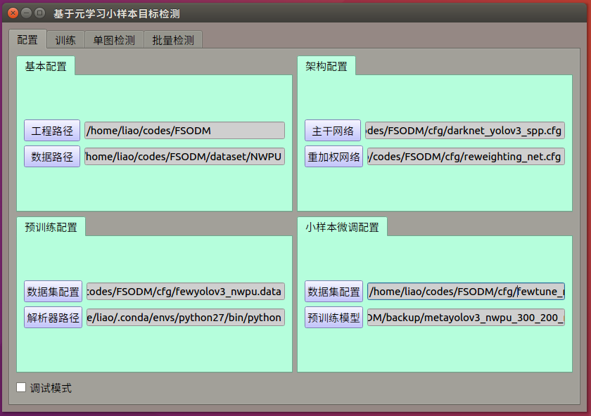
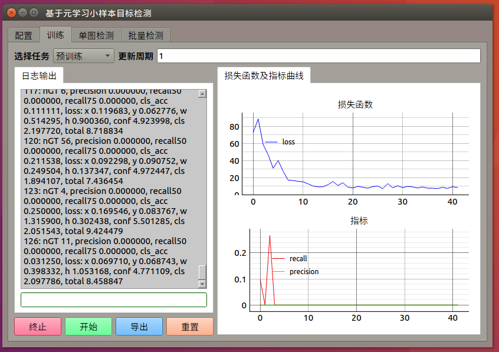
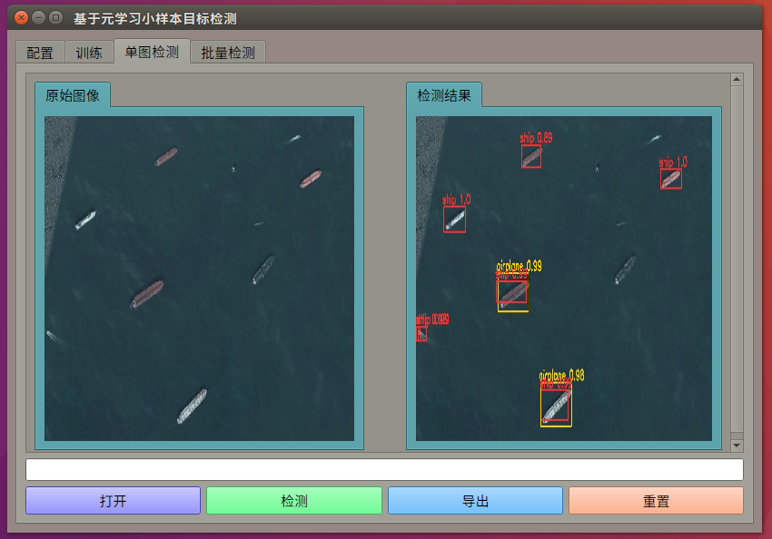

# Object Detection UI

This is a multi-panel visualization tool for training and inference of an object detection model (e.g., the YOLO family, SSD, etc). It has the following panels:
1. Configuration panel, where you set the paths of different configuration files.
2. Training visualization panel, where the model is trained in the background with its loss and accuracy plotted in the frame (left-hand side) and logged in the console (right-hand side).
3. Single image detection panel, where an input image and the detection visualization of it are displayed side by side for comparison.
4. Multiple image detection panel, where multiple images are detected in a single batch with the results replacing them.

## Screenshots

Configuration panel:

Training visualization panel:

Single image detection panel:

Multiple image detection panel:

## Usage

1. Install dependencies with `requirements.txt`.
2. Run `main.py`.
