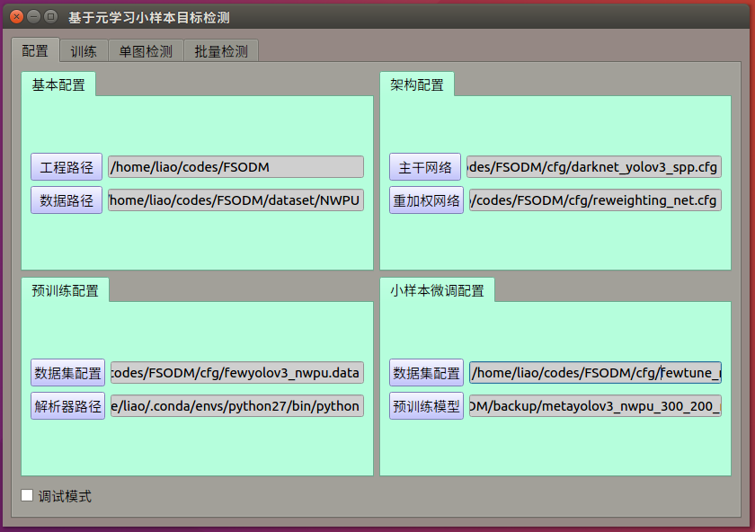
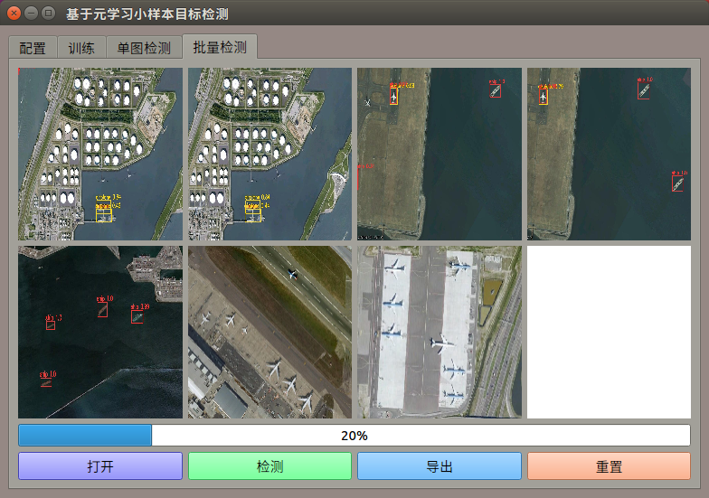

# 基于元学习小样本目标检测

<div align=left>

</div>

<div align=left>

</div>

<div align=left>

</div>

<div align=left>

</div>


## 安装依赖

```shell
conda env create -f /home/liao/codes/Object_Detection_UI/environment_UI.yml
```

## 运行界面

```shell
cd /home/liao/codes/Object_Detection_UI/
./run_UI.sh
```

## 运行打包好的二进制文件

若安装依赖遇到困难，可以直接运行打包好的二进制文件，不需要安装任何依赖。

```shell
cd /home/liao/codes/Object_Detection_UI/
./dist/main/main
```
